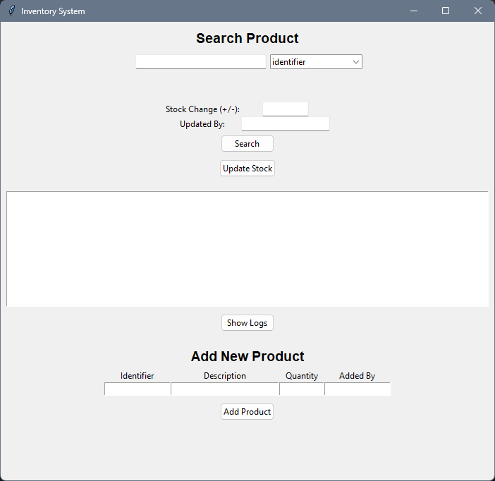

# 🧾 Inventory Management System

A local, GUI-based inventory management system built using **Python**, **Tkinter**, and **SQLite**.  
This tool helps track product stock, manage quantity updates, and log stock movement — all from a simple desktop interface.

---

## 🚀 Features

- ✅ Add new products with unique identifiers
- 🔍 Search products by ID, description, or last updated user
- ➕➖ Update stock quantity with proper user tagging
- 🕓 View full logs of stock movement per item
- 💾 Fully local database using SQLite (`inventory.db`)
- 🖥️ Simple Tkinter-based GUI — no need for a browser
- 🪟 Works natively on **Windows** (with `.exe` support)

---

## 🖼️ GUI Preview



---

## 🧑‍💻 Tech Stack

- **Python 3.x**
- **Tkinter** (for GUI)
- **SQLite3** (for local database)

---

## 🛠️ How to Run

### 🔧 Requirements

- Python 3.x installed
- No external libraries required

### ▶️ Run via Python

```bash
python inventory.py
